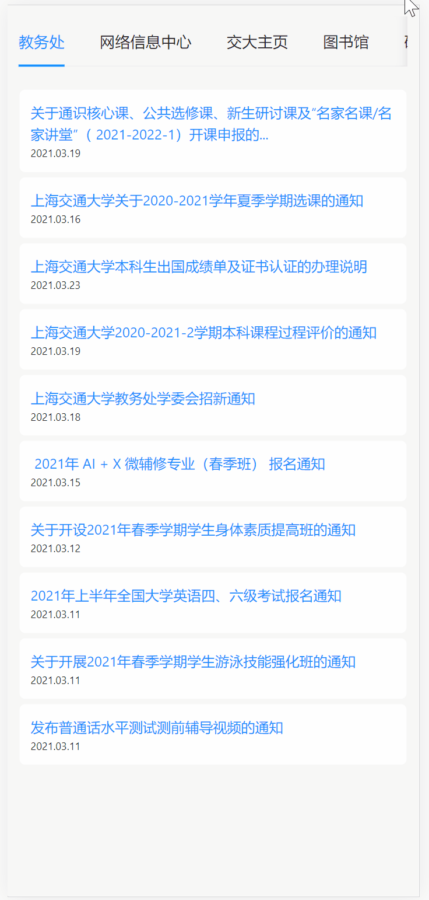

## 交大通通--通知即时获取tool

#### 主要语言

- 前端界面：JavaScript
  - 使用React框架，结合Antd组件库
- 后端接口：Golang
  - 使用Gin框架

#### 运行环境

- 前端需要Nodejs
- 后端需要Golang 环境
  - 或者直接使用编译好的二进制文件(这里仅提供exe)

前端以及后端语言皆可以跨平台，项目亦可跨平台


#### 主要结构

##### 框架图


##### demo



##### 后端代码结构

```
.
├── README.md # 相关说明
├── go.mod
├── go.sum
├── main.go  # main文件
├── middleware  # 中间件
│   └── cors.go  # 跨域访问中间处理
├── scraper  # 相关的爬虫文件
│   ├── docs.go
│   ├── graduate.go  # 研招网信息获取
│   ├── graduate_test.go
│   ├── item.go # 定义爬取的信息结构
│   ├── jwc.go  # 教务处信息获取
│   ├── jwc_test.go
│   ├── lib.go  # 图书馆信息获取
│   ├── lib_test.go
│   ├── net.go  # 网络信息中心信息获取
│   ├── net_test.go
│   ├── utils.go  # 工具代码
│   ├── www.go  # 教务处信息获取
│   └── www_test.go
└── utils.go  # 工具代码
```

##### 前端代码结构

```
.
├── README.md # 相关说明
├── package.json
├── public
│   ├── favicon.ico
│   ├── index.html
│   ├── logo192.png
│   ├── logo512.png
│   ├── manifest.json
│   └── robots.txt
├── src # 主要代码
│   ├── App.css
│   ├── App.js
│   ├── App.test.js
│   ├── components  # 主要组件
│   │   ├── Notices.js  # 通知消息组件
│   │   └── Tab.js  # 标签页组件
│   ├── index.js # 入口
│   ├── reportWebVitals.js
│   ├── setupTests.js
│   ├── style  # 样式
│   │   ├── Home.css # 首页样式
│   │   └── Notices.css # 通知消息样式
│   └── views  # 视图
│       └── Home.js
└── yarn.lock
```


